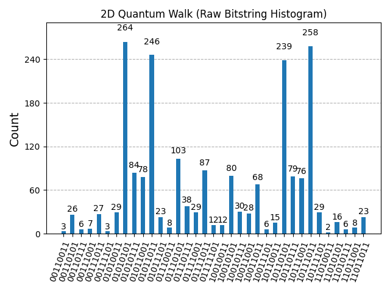
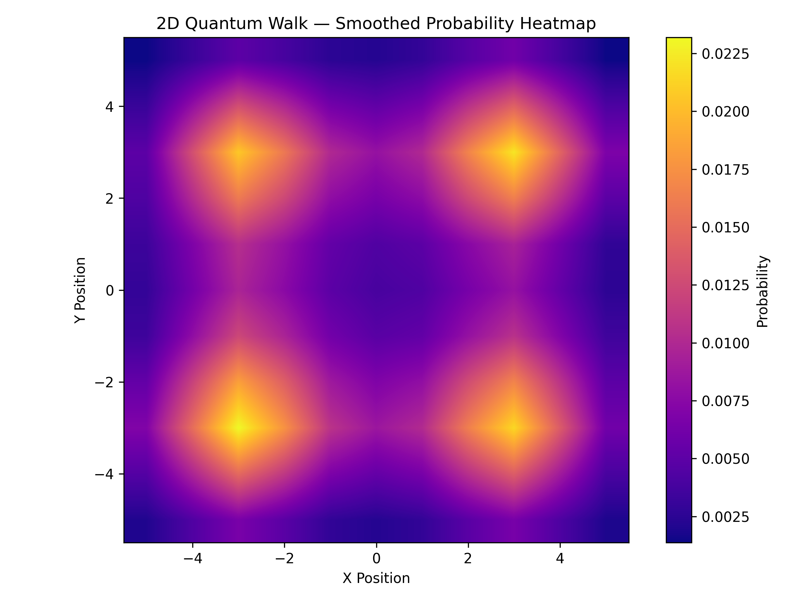

# 🌀 Quantum Walks: Classical vs Quantum Random Walk Simulation

A simulation-based project that compares classical and quantum random walks in 1D and 2D. Visualizations like histograms are used to illustrate probability distributions and highlight the fundamental difference in spreading behavior between the two types of walks.

---

## ✨ Key Features

- ✅ Classical random walk simulation (1D and 2D)
- ✅ Quantum random walk simulation using Qiskit (1D and 2D)
- ✅ Smoothed heatmaps and 3D surface plots
- ✅ Raw bitstring histograms of quantum walk measurements
- ✅ Clear comparison between classical and quantum spreading behaviors
- ✅ Data saved for reproducibility (`/results` directory)

---

## 🔬 Background

### 🧍 Classical Random Walk (CRW)

- At each step, the walker moves **left or right** (or up/down in 2D) with **equal probability**.
- Probability distribution forms a **binomial distribution** (approaches Gaussian for large `n`).
- **Spread** is proportional to √n (diffusive).

### 🧑‍🚀 Quantum Random Walk (QRW)

- Uses quantum **superposition** and **interference**.
- Incorporates **Hadamard gates** and **coin states**.
- Results in **non-Gaussian, peaked distributions**.
- **Spread** is proportional to `n` (ballistic).

---

## 📊 Output Samples

### 📌 Classical Walk
- Smooth Gaussian-like distribution
- Linear dispersion

### 📌 Quantum Walk (1D & 2D)
- Interference patterns
- Bell-shaped probability with sharper peaks
- Faster spread and localization

  
  

---

🧪 Installation

Clone the repository:

git clone https://github.com/DeepanshuRanolia/Quantum-Superposition-using-Random-Walks.git

🧪 Experiments to Try

Vary n (number of steps): Observe how the spread of the probability distribution scales in classical vs quantum walks.

📚 References

Quantum Walks – Wikipedia

Nielsen & Chuang, Quantum Computation and Quantum Information

IBM Qiskit Documentation – For quantum simulation

📌 Notes

Quantum walks require a quantum simulator (e.g., Qiskit's AerSimulator).

This project uses only simulation — no real quantum hardware is needed.

Adjust the steps variable in the code to control the walk length.

🙌 Acknowledgements

Developed by Deepanshu, BS Physics, IIT Jodhpur

Guided by a deep interest in quantum superposition, algorithms, and quantum computing

